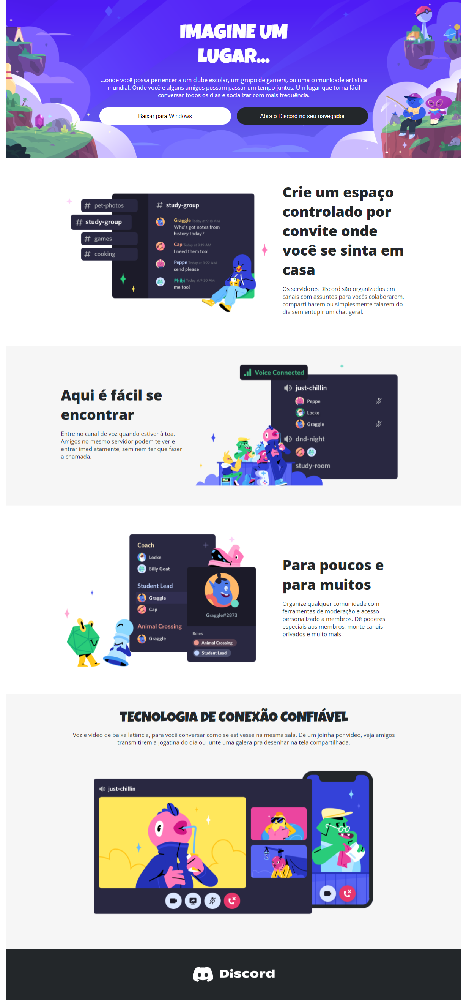

## 🏋️‍♂️ Desafio de Projeto HTML + CSS: Construindo um Layout Responsivo Para o Site do Discord Com CSS. 

Desafio de projeto proposto para criação de um layout responsivo do site Discord.   
Os temas abordados são: 
- Unidades de medidas.
- Estruturação e formatação de texto.
- Conceitos de media query.
- Dimensionamento de imagens.
- Responsividade 

Além de outros recursos.

## 💻 Tecnologias utilizadas nesse projeto:

  
  

## 💻 Preview:
- Veja como ficou o projeto acessando: [o link do Github Pages](https://ernandesneponuceno.github.io/Construindo-Layout-Responsivo-do-Discord/)
  

## 🤔 O que aprendi com esse projeto:
- Aprimorar minhas habilidades em HTML e CSS.
- Utilizar os recursos de responsividade.
- Estilização de textos e boas práticas de design.
- Utilização de unidades de medidas voltadas para responsividade.
- Utilização do figma para criação de Layout.

## 📌 Créditos
- **Assets:** ✨Layout disponibilizado no figma, no seguinte endereço:
  [https://www.figma.com/file/NRBYrG5d4DSzObv7dpTqoM/Desafio-Responsividade---DIO?node-id=1%3A69&mode=dev](https://www.figma.com/file/NRBYrG5d4DSzObv7dpTqoM/Desafio-Responsividade---DIO?node-id=1%3A69&mode=dev)
